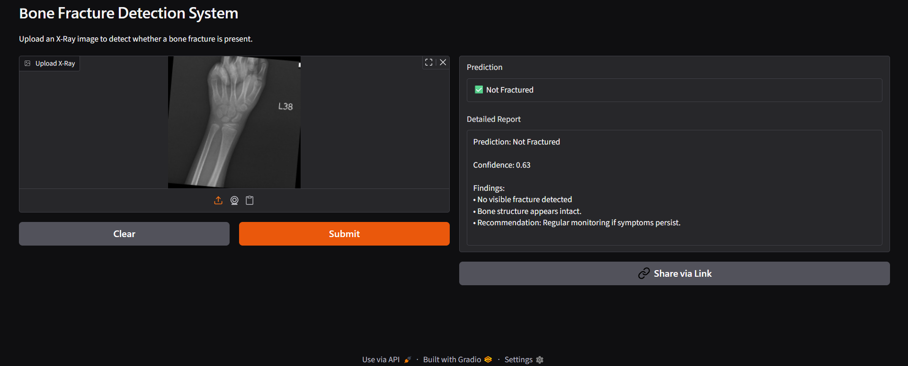
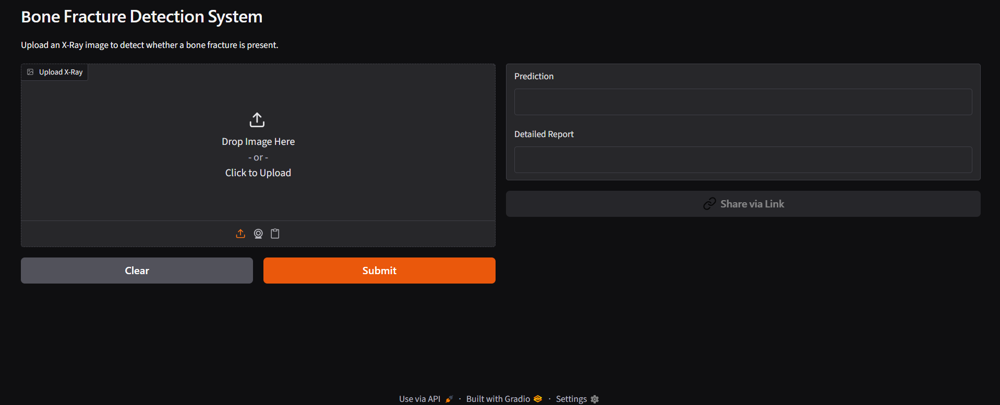

# 🦴 Bone Fracture Detection System

An AI-powered medical imaging application that detects bone fractures from X-ray images using Deep Learning. The system analyzes uploaded X-ray images, predicts whether a fracture is present, and generates a detailed diagnostic report with confidence scores.

## 🌐 Live Demo

**Hugging Face Deployment:**

https://huggingface.co/spaces/Venkatesh998/bone-fracture-detection

## 📌 Project Overview

The Bone Fracture Detection System is designed to assist in the preliminary analysis of bone X-ray images. Using a trained TensorFlow deep learning model, the application classifies X-rays as:

* 🩻 Fractured
* ✅ Not Fractured

The project includes a web-based interface that allows users to upload X-ray images and instantly receive AI-generated predictions and reports.

---

## 🚀 Features

* Upload bone X-ray images
* AI-powered fracture detection
* Confidence score prediction
* Detailed diagnostic report generation
* User-friendly web interface
* TensorFlow deep learning model
* Cloud deployment using Hugging Face Spaces
* Real-time image analysis

---

## 🛠️ Technologies Used

### Programming Language

* Python

### Deep Learning & AI

* TensorFlow
* Keras
* MobileNetV2

### Web Development

* Flask (Local Version)
* Gradio (Deployment Version)

### Image Processing

* PIL (Python Imaging Library)
* NumPy

### Deployment

* Hugging Face Spaces

### Version Control

* Git
* GitHub

---

## 📂 Project Structure

Bone-Fracture-Detection-System/

├── model/

│   └── fracture_model.keras

├── static/

├── templates/

├── app.py

├── predict.py

├── train_model.py

├── requirements.txt

├── README.md

└── documentation/

---

## 🧠 Model Architecture

### Base Model

* MobileNetV2 (Transfer Learning)

### Image Size

* 224 × 224 pixels

### Classification Classes

* Fractured
* Not Fractured

### Training Framework

* TensorFlow / Keras

### Output

* Prediction Label
* Confidence Score
* Diagnostic Report

---

## ⚙️ How It Works

### Step 1: Upload X-Ray

The user uploads a bone X-ray image through the web interface.

### Step 2: Image Preprocessing

The image is:

* Resized to 224 × 224
* Converted into an array
* Normalized to values between 0 and 1

### Step 3: Model Prediction

The TensorFlow model analyzes the image and predicts:

* Fractured
* Not Fractured

### Step 4: Report Generation

A detailed report is generated including:

* Prediction
* Confidence Score
* Findings
* Recommendation

---

## 📋 Sample Output

### Fractured

Prediction: Fractured

Confidence: 75.00%

Findings:

* Probable fracture detected
* Location: Left forearm region
* Recommendation: Clinical confirmation advised

---

### Not Fractured

Prediction: Not Fractured

Confidence: 98.00%

Findings:

* No visible fracture detected
* Bone structure appears intact
* Recommendation: Regular monitoring if symptoms persist

---

## 📊 Workflow

X-Ray Upload

↓

Image Preprocessing

↓

TensorFlow Model

↓

Prediction

↓

Report Generation

↓

Display Result

---

## 💻 Local Installation

### Clone Repository

```bash
git clone https://github.com/Venkateshdevarapalle/Bone-Fracture-Detection-System.git
cd Bone-Fracture-Detection-System
```

### Create Virtual Environment

```bash
python -m venv venv
```

### Activate Environment

Windows:

```bash
venv\Scripts\activate
```

### Install Dependencies

```bash
pip install -r requirements.txt
```

### Run Application

```bash
python app.py
```

Open:

```text
http://127.0.0.1:5000
```

---

## 🎯 Applications

* Medical Image Analysis
* Healthcare AI Solutions
* Radiology Assistance
* Medical Education
* Deep Learning Research
* AI-Powered Diagnostic Systems

---

## 🔮 Future Enhancements

* Multi-class fracture detection
* Fracture localization using bounding boxes
* Heatmap visualization using Grad-CAM
* Mobile application deployment
* Hospital system integration
* PDF report generation
* Doctor dashboard

---

## 📸 Application Preview

### 🏠 Home Page


### 🩻 Fracture Detection Result



### ✅ Non-Fracture Detection Result



---

## 👨‍💻 Author

**Venkatesh Devarapalle**

Data Science Student | AI & Machine Learning Enthusiast

GitHub:
https://github.com/Venkateshdevarapalle

Hugging Face:
https://huggingface.co/Venkatesh998

---

## ⭐ Acknowledgements

This project was developed as part of practical learning in:

* Deep Learning
* Computer Vision
* Medical Image Analysis
* TensorFlow & Keras
* AI Application Deployment

---

### If you found this project useful, please consider giving it a ⭐ on GitHub.
